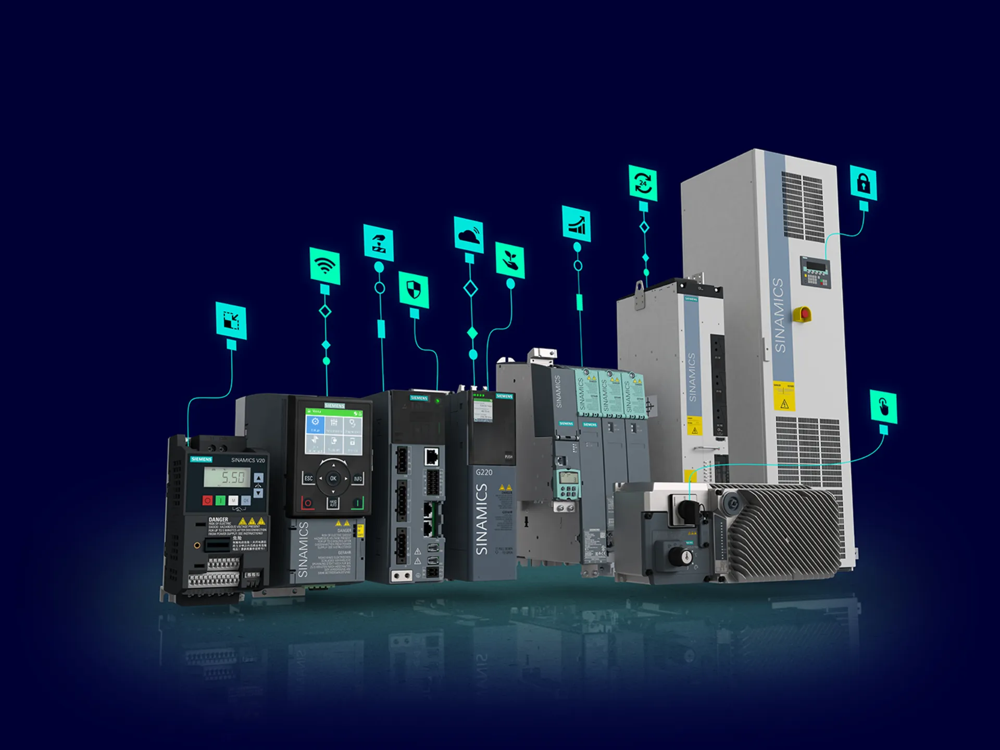

# Image Management Guide for SyncAmpere Website

## How to Add Images to Make the Site More Appealing

### 1. **VFD Panel Image**
- **File:** `vfd-panel.jpg`
- **Location:** Replace the current `vfd-panel.jpg` in the root directory
- **Recommended Specs:**
  - **Size:** 1200x800px (landscape)
  - **File Size:** 200-400KB (compressed)
  - **Format:** JPEG or WebP
  - **Content:** Clear photo of VFD control panel with visible displays and indicators

### 2. **Adding New Images to Different Sections**

#### Overview Section
```html
<div class="overview-image">
    
</div>
```
- **Recommended Size:** 600x400px
- **Best for:** Technical diagrams, schematic images

#### Feature Cards
```html
<div class="feature-icon">⚡</div>
<!-- Replace emoji with SVG icon or image -->

```
- **Recommended Size:** 100x100px
- **Best for:** SVG icons or simple graphics

### 3. **Image Optimization Tips**

#### For Better Performance:
1. **Compress images:**
   - Use TinyPNG, ImageOptim, or similar tools
   - Target: < 300KB per image

2. **Use multiple formats:**
   - WebP for modern browsers (smaller file size)
   - JPEG/PNG as fallback
   ```html
   <picture>
       <source srcset="image.webp" type="image/webp">
       
   </picture>
   ```

3. **Responsive images:**
   ```html
   
   ```

### 4. **Current Image Styling**

All images use modern CSS classes:
- `.hero-panel-image` - Hero section images
- `.panel-image` - Overview section images
- `.feature-icon` - Feature section icons

Styles already include:
- Responsive sizing
- Smooth shadows
- Hover effects
- Rounded corners

### 5. **Recommended Image Locations**

Place images in the same directory as `index.html`:
```
/Users/ravinash/syncampere-website/
├── index.html
├── styles.css
├── vfd-panel.jpg (existing)
├── hero-bg-pattern.svg (optional)
├── siemens-logo.png (optional)
├── danfoss-logo.png (optional)
└── [other images]
```

### 6. **Adding Partner Logos**

To add Siemens and Danfoss logos:

```html
<div class="partner-badge">
    
    <span class="partner-role">Technology Partner</span>
</div>
```

Add CSS:
```css
.partner-logo {
    max-width: 80px;
    height: auto;
    margin-bottom: 5px;
}
```

### 7. **Color Enhancement with Images**

- Use images with consistent color schemes (blues, grays, whites)
- Ensure text remains readable over images
- Use image overlays for text:
```css
background: linear-gradient(rgba(0,0,0,0.3), rgba(0,0,0,0.3)), url('image.jpg');
```

### 8. **SVG Icons (Best Practice)**

Replace emojis with custom SVGs for professional appearance:
```html
<svg class="feature-icon" viewBox="0 0 24 24">
    <path d="..."/>
</svg>
```

### Current Image Sizes

- **Hero Panel:** 420px max-height (responsive)
- **Overview Panel:** Full width, auto-height
- **Feature Cards:** Emoji (32px)
- **Partner Badges:** 100x100px area
- **Stat Boxes:** Text-based, no images

### Image Format Recommendations

| Use Case | Format | Size | Quality |
|----------|--------|------|---------|
| VFD Panel Photo | JPEG/WebP | 1200x800 | 85% |
| Technical Diagram | PNG/SVG | 600x400 | Lossless |
| Icons | SVG | 100x100 | Scalable |
| Logos | PNG/SVG | 200x100 | Transparent |
| Background | SVG/JPEG | Full width | 60% |

### Tools for Image Optimization

1. **Online Tools:**
   - TinyPNG.com
   - ImageOptim.com
   - Squoosh.app

2. **Desktop Tools:**
   - ImageMagick
   - GIMP
   - Adobe Photoshop

3. **Command Line:**
   ```bash
   # Compress with ImageMagick
   convert input.jpg -quality 85 -resize 1200x800 output.jpg
   
   # Convert to WebP
   cwebp -q 85 input.jpg -o output.webp
   ```

### Accessibility Best Practices

Always include descriptive alt text:
```html

```

### Next Steps

1. Replace `vfd-panel.jpg` with high-quality image (1200x800px, <300KB)
2. Add partner logos to the partnerships section
3. Consider adding background SVG patterns for visual interest
4. Add technical diagrams to the overview section
5. Replace emoji icons with custom SVG icons for a professional look

For more details on responsive images, visit: https://developer.mozilla.org/en-US/docs/Learn/HTML/Multimedia_and_embedding/Responsive_images
